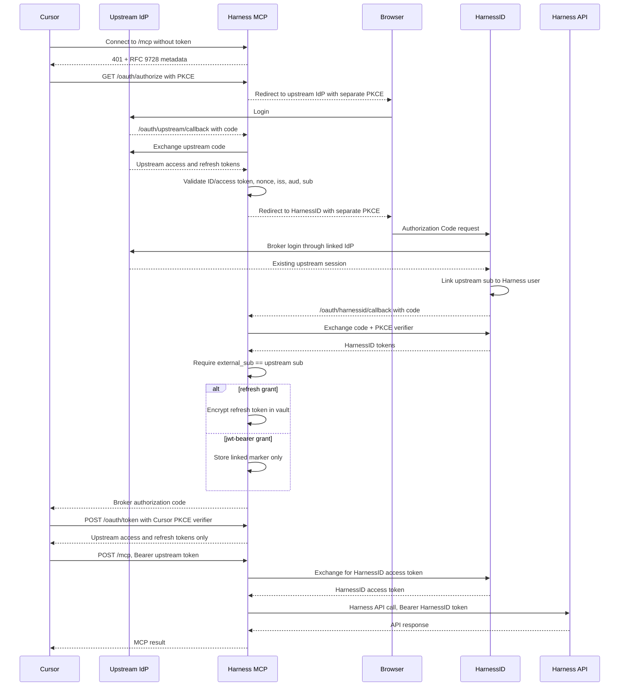
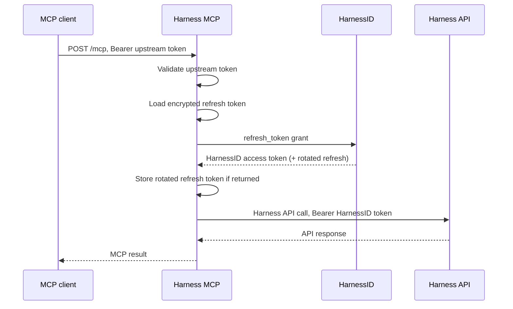
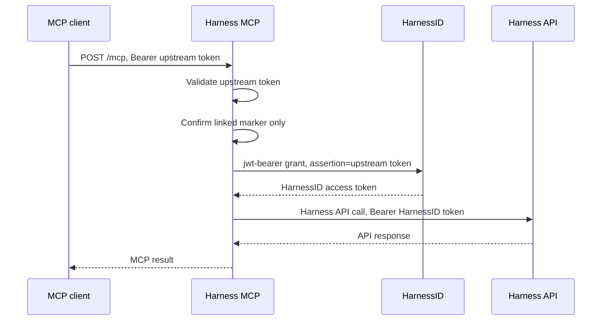

# Upstream identity provider OAuth proxy mode

`HARNESS_MCP_MODE=oauth-proxy` is for an MCP registry or client that sends an
access token issued by an external OpenID Connect provider. The MCP server
validates that upstream token on every request and obtains a per-user HarnessID
token with a confidential HarnessID client.

The HarnessID token—not the upstream token—is sent to Harness APIs. Harness RBAC
and audit records therefore use the linked Harness user.

Two HarnessID grant methods are supported:

- `refresh`: first login returns a HarnessID refresh token. It is encrypted at
  rest and rotated when HarnessID returns a replacement.
- `jwt-bearer`: every exchange uses the upstream JWT as an RFC 7523 assertion.
  No refresh token or other token material is persisted.

Both methods require one browser login to create the upstream-provider-to-
HarnessID user link. The vault always stores short-lived PKCE state and a
non-secret linked marker. Only `refresh` mode stores a token. Use the local
encrypted file for a single pod. Use Redis when more than one pod must share
that state.

## End-to-end Cursor flow

The OAuth authorization broker and Harness token exchange both live inside the
MCP server. There is no separate proxy process. Cursor starts a normal OAuth
login, receives only the upstream provider's access and refresh tokens, and
sends the upstream access token on every MCP request. HarnessID tokens never
leave the server.

| Component | Role |
| --- | --- |
| Cursor | Starts OAuth, holds the upstream tokens, and calls `/mcp` |
| Upstream identity provider | Issues the bearer token the client presents |
| Harness MCP (`oauth-proxy` mode) | Acts as Cursor's OAuth broker, validates the upstream token, links the user once, exchanges for a HarnessID token, and calls Harness |
| HarnessID | Links the upstream subject to a Harness user and issues the Harness token |
| Harness API | Applies the linked user's Harness RBAC |

| Token | Issued by | Used by |
| --- | --- | --- |
| Upstream token | Upstream identity provider | Client → MCP on every request |
| HarnessID token | HarnessID | MCP → Harness API only |

### First Cursor connection and link



### Later requests — refresh grant



### Later requests — jwt-bearer grant

No Harness token is stored. Each request reuses the upstream JWT as an RFC 7523
assertion.



### Security boundaries

- Cursor's authorization code, the upstream provider code, and the HarnessID
  code use independent state and S256 PKCE values.
- Temporary upstream tokens are encrypted in the vault and atomically removed
  when Cursor redeems its one-time code.
- `/oauth/token` strips upstream ID tokens and every HarnessID token.
- HarnessID linking accepts an exact upstream `sub` match. It also accepts
  Okta's access-token `uid` when that equals the ID token `sub`, and an email
  or `preferred_username` that equals the other token's subject. An email is
  rejected only when `email_verified` is explicitly false. Suffix matches are
  rejected.
- The upstream refresh-token grant is proxied so Cursor can rotate its upstream
  token without receiving any Harness credential.

The upstream token remains mandatory on every MCP request, including requests
for an existing MCP session.

## 1. Configure the upstream identity provider

Create or choose an OpenID Connect authorization server with:

- A stable HTTPS issuer.
- An RS256 JWKS endpoint.
- Short-lived JWT access tokens.
- Stable `sub` values for users.
- `iss`, `sub`, `aud`, `iat`, and `exp` claims.
- `email`, `profile`, or other claims required by the HarnessID broker login.

Register the MCP server as a confidential web OAuth client at that provider:

```text
Authorization Code: enabled
Refresh Token: enabled
Redirect URI: https://<mcp-host>/oauth/upstream/callback
Scopes: openid profile email offline_access
```

The server uses this client to complete the upstream Authorization Code flow.
Cursor is separately registered as a public client of the MCP broker and never
receives this client secret.

The token sent to MCP must contain the exact audience configured through
`HARNESS_MCP_UPSTREAM_AUDIENCE`.

Use a dedicated MCP proxy audience such as:

```text
api://harness-mcp-proxy
```

For `jwt-bearer` mode, the same JWT also becomes an RFC 7523 assertion. Keycloak
requires its `aud` to contain exactly one value identifying the HarnessID
issuer or token endpoint:

```text
https://id.example.com/idp/realms/HarnessIDP
```

If the normal MCP token has a different audience, configure the upstream
provider's on-behalf-of or token-exchange feature to issue a short-lived
assertion token for HarnessID. The MCP registry must send that assertion token
to this server. Do not use a multi-valued `aud`; Keycloak rejects it for this
grant. Keycloak also offers a custom audience mapping, but that is non-standard
and weakens the normal audience boundary.

## 2. Configure the upstream provider in HarnessID

In the `HarnessIDP` realm:

1. Open **Identity providers**.
2. Add an **OpenID Connect v1.0** provider.
3. Configure its issuer, authorization endpoint, token endpoint, userinfo
   endpoint, JWKS endpoint, client ID, and client secret.
4. Set the alias that the MCP deployment will use in
   `HARNESS_MCP_OAUTH_IDP_HINT`.
5. Link the provider to the Harness organization.
6. Ensure first broker login creates or links the correct Harness user.

For unattended first linking, use a provider-specific first-login flow that
automatically links only when the upstream provider is authoritative for the
email domain. Otherwise retain Keycloak's confirmation step.

The HarnessID user must have a federated identity link whose provider user ID
equals the upstream JWT `sub`, its `uid`, or its email. Okta often puts the
user ID in the ID token `sub` and the email in the access token `sub`. The
access token `uid` is the same user ID. An `email` or `preferred_username`
claim is also accepted unless `email_verified` is explicitly false.

## 3. Configure the confidential HarnessID client

Create a confidential OpenID Connect client:

```text
Client ID: harness-mcp-proxy
Client authentication: On
Standard flow: On
Direct access grants: Off
Service accounts: Off
PKCE method: S256
Valid redirect URI: https://<mcp-host>/oauth/harnessid/callback
```

Assign these client scopes:

```text
openid profile email organization
```

The `organization` scope must produce `account_id` and `account_metadata`.

Add a client mapper that copies the broker's external user ID session note into
both the access token and ID token:

```text
Mapper type: User Session Note
User Session Note: identity_provider_identity
Token Claim Name: external_sub
Add to access token: On
Add to ID token: On
```

If your broker flow uses `broker.user.id` instead, map that note. The configured
claim name must match `HARNESS_MCP_OAUTH_EXTERNAL_SUB_CLAIM`.

## 4A. Refresh-token method

Set:

```bash
HARNESS_MCP_OAUTH_PROXY_GRANT=refresh
```

HarnessID client requirements:

- Standard flow enabled.
- Refresh tokens enabled.
- Refresh-token rotation enabled if required by policy.
- Session and refresh-token lifetimes appropriate for the deployment.

After first linking, the encrypted vault stores the refresh token under the
upstream issuer and subject. On every MCP request:

1. The upstream bearer token is revalidated.
2. The stored refresh token is sent to HarnessID.
3. The returned HarnessID access token is validated and used for Harness APIs.
4. A rotated refresh token replaces the previous value.

Operational requirements:

- Keep `HARNESS_MCP_OAUTH_PROXY_VAULT_KEY` in a secret manager.
- File mode, the default, writes `HARNESS_MCP_OAUTH_PROXY_VAULT_PATH` on the
  pod. Use it for single-pod testing. Mount that path on persistent storage if
  the refresh token must survive a restart.
- Redis mode shares the same encrypted records across pods. Set
  `HARNESS_MCP_OAUTH_PROXY_VAULT_MODE=redis` and
  `HARNESS_MCP_OAUTH_PROXY_REDIS_URL` to a `redis://` or `rediss://` URL.
  Redis 6.2 or newer is required. Login transactions and one-time
  authorization codes are stored there too, so an OAuth callback can land on
  any pod.
- Values are encrypted with the vault key before they are written. A rotated
  refresh token is published under a per-user lock so two pods do not redeem
  the same token.
- Changing or losing the vault key requires users to link again.
- Redis does not move MCP session state. Session affinity is still required
  when running more than one replica.

## 4B. JWT bearer method with no persisted token

Set:

```bash
HARNESS_MCP_OAUTH_PROXY_GRANT=jwt-bearer
```

In the HarnessID confidential client:

1. Open **Clients → harness-mcp-proxy → Settings**.
2. Enable **JWT Authorization Grant**.
3. Under **Allowed Identity Providers for JWT Authorization Grant**, select the
   upstream provider alias.

Equivalent client attributes are:

```text
oauth2.jwt.authorization.grant.enabled=true
oauth2.jwt.authorization.grant.idp=<upstream-provider-alias>
```

In **Identity providers → upstream provider → Authorization Grant Settings**:

1. Enable **JWT Authorization Grant**.
2. Set the assertion issuer to the exact upstream `iss`.
3. Enable JWKS URL and configure the upstream signing-key endpoint.
4. Restrict the assertion signature algorithm, normally `RS256`.
5. Set maximum assertion expiration, normally five minutes.
6. Configure allowed clock skew.
7. Decide how replay protection will work.

Keycloak normally requires a unique `jti` and rejects assertion reuse. This MCP
server may exchange the same short-lived upstream token on more than one MCP
request. Therefore choose one of:

- Have the upstream system issue a fresh assertion with a new `jti` for every
  MCP request; or
- Enable **Allow assertion reuse** and keep the assertion lifetime short.

The assertion must contain:

```json
{
  "iss": "https://login.example.com/oauth2/default",
  "sub": "stable-external-user-id",
  "aud": "https://id.example.com/idp/realms/HarnessIDP",
  "iat": 1764839065,
  "exp": 1764839365,
  "jti": "unique-assertion-id"
}
```

The MCP server sends:

```http
POST https://id.example.com/idp/realms/HarnessIDP/protocol/openid-connect/token
Authorization: Basic <base64(client-id:client-secret)>
Content-Type: application/x-www-form-urlencoded

grant_type=urn:ietf:params:oauth:grant-type:jwt-bearer
&assertion=<upstream-jwt>
&scope=openid profile email organization
```

Keycloak's JWT Authorization Grant does not issue a refresh token. This server
does not persist the assertion, HarnessID access token, or refresh token. The
encrypted vault contains only PKCE transaction state and the linked marker.

Reference: [Keycloak JWT Authorization Grant](https://www.keycloak.org/securing-apps/jwt-authorization-grant).

## 5. Configure and start the MCP server

For local Cursor testing, register these exact callbacks first:

```text
Upstream OAuth client: http://127.0.0.1:3000/oauth/upstream/callback
HarnessID client:      http://127.0.0.1:3000/oauth/harnessid/callback
Cursor broker client:  http://localhost:8787/callback
```

The first two clients are confidential server-side clients. The Cursor broker
client is public and requires S256 PKCE.

Common local QA configuration:

```bash
export HARNESS_MCP_MODE=oauth-proxy
export HARNESS_ALLOW_HTTP=true
export HOST=127.0.0.1
export PORT=3000

export HARNESS_BASE_URL=https://mcp.harness-test.com/cli
export HARNESS_MCP_OAUTH_RESOURCE=http://127.0.0.1:3000/mcp
export HARNESS_MCP_OAUTH_PROXY_PUBLIC_URL=http://127.0.0.1:3000
export HARNESS_MCP_BROKER_ISSUER=http://127.0.0.1:3000
export HARNESS_MCP_BROKER_CLIENT_ID=cursor-harness-mcp
export HARNESS_MCP_BROKER_REDIRECT_URIS=http://localhost:8787/callback

export HARNESS_MCP_OAUTH_ISSUER=https://id.harness-test.com/idp/realms/HarnessIDP
export HARNESS_MCP_OAUTH_CLIENT_ID=harness-mcp-proxy
export HARNESS_MCP_OAUTH_CLIENT_SECRET='<HarnessID confidential client secret>'
export HARNESS_MCP_OAUTH_IDP_HINT=okta
export HARNESS_MCP_OAUTH_EXTERNAL_SUB_CLAIM=external_sub
export HARNESS_MCP_OAUTH_SCOPES='openid profile email organization'

export HARNESS_MCP_UPSTREAM_ISSUER=https://your-org.oktapreview.com/oauth2/default
export HARNESS_MCP_UPSTREAM_AUDIENCE='<exact upstream token aud>'
export HARNESS_MCP_UPSTREAM_JWKS_URI=https://your-org.oktapreview.com/oauth2/default/v1/keys
export HARNESS_MCP_UPSTREAM_SCOPES='openid profile email offline_access'
export HARNESS_MCP_UPSTREAM_OAUTH_CLIENT_ID='<upstream confidential client ID>'
export HARNESS_MCP_UPSTREAM_OAUTH_CLIENT_SECRET='<upstream confidential client secret>'

export HARNESS_MCP_OAUTH_PROXY_VAULT_KEY="$(openssl rand -base64 32)"
export HARNESS_MCP_OAUTH_PROXY_VAULT_MODE=file
export HARNESS_MCP_OAUTH_PROXY_VAULT_PATH=.harness-mcp/oauth-proxy-vault.enc
# Multi-pod alternative:
# export HARNESS_MCP_OAUTH_PROXY_VAULT_MODE=redis
# export HARNESS_MCP_OAUTH_PROXY_REDIS_URL=rediss://oauth-vault:6379/0
# export HARNESS_MCP_OAUTH_PROXY_REDIS_KEY_PREFIX=harness-mcp:oauth

# Choose one:
export HARNESS_MCP_OAUTH_PROXY_GRANT=refresh
# export HARNESS_MCP_OAUTH_PROXY_GRANT=jwt-bearer
```

Start the integrated server:

```bash
pnpm install
pnpm build
pnpm start:http
```

Production deployments must use HTTPS and remove `HARNESS_ALLOW_HTTP=true`.

Check discovery before connecting Cursor:

```bash
curl -s http://127.0.0.1:3000/.well-known/oauth-protected-resource/mcp | jq
curl -s http://127.0.0.1:3000/.well-known/oauth-authorization-server | jq
```

The first response must advertise `http://127.0.0.1:3000` in
`authorization_servers`; the second must publish the broker's `/oauth/authorize`
and `/oauth/token` endpoints.

## 6. Test end to end with Cursor

Create `.cursor/mcp.json` in the project opened by Cursor:

```json
{
  "mcpServers": {
    "harness-oauth-proxy": {
      "url": "http://127.0.0.1:3000/mcp",
      "auth": {
        "CLIENT_ID": "cursor-harness-mcp",
        "scopes": ["openid", "profile", "email", "offline_access"]
      }
    }
  }
}
```

Then:

1. Fully restart Cursor after saving `mcp.json`.
2. Open **Cursor Settings → MCP** and reconnect `harness-oauth-proxy`.
3. Cursor opens the embedded broker. Sign in to the upstream provider.
4. HarnessID opens next. Select the Harness organization if prompted and finish
   the organization-linked identity-provider login.
5. HarnessID returns to MCP; MCP returns a one-time authorization code to
   Cursor.
6. Cursor redeems the code and stores only the upstream access/refresh tokens.
7. Cursor initializes `/mcp` with the upstream access token. MCP obtains the
   HarnessID token internally.

From Cursor Agent, run:

```text
Use the Harness MCP server to list the first five organizations.
```

Then:

```text
Use Harness MCP to show my current user and list the first five projects in
the selected account.
```

Confirm in server logs that the upstream callback completed before HarnessID
linking and that Harness API calls use the linked `account_id`. Tokens are
deliberately excluded from logs.

Repeat once with `HARNESS_MCP_OAUTH_PROXY_GRANT=refresh`, then with
`jwt-bearer`. Before switching, stop the server and remove the local test vault
so the first-link behavior is exercised again:

```bash
rm -f .harness-mcp/oauth-proxy-vault.enc
```

## Troubleshooting

- `Invalid upstream access token`: verify signature, `iss`, `aud`, expiry, and
  the configured JWKS URI.
- Cursor does not open a browser: verify protected-resource metadata advertises
  the broker issuer, not the upstream issuer, and that Cursor's `CLIENT_ID`
  exactly matches `HARNESS_MCP_BROKER_CLIENT_ID`.
- `invalid_redirect_uri`: register `/oauth/upstream/callback` at the upstream
  provider, `/oauth/harnessid/callback` at HarnessID, and allow
  `http://localhost:8787/callback` through
  `HARNESS_MCP_BROKER_REDIRECT_URIS`.
- Upstream callback fails nonce validation: ensure the upstream client returns
  a signed ID token when `openid` is requested.
- `does not match the access token subject or verified email`: the server log
  lists the claim names on each token. Okta's access token needs `uid`, or one
  token needs `email` or `preferred_username` equal to the other token's
  subject. `email_verified: false` rejects the email.
- `HarnessID token claim "external_sub" does not match`: the confidential
  client mapper is missing, and the HarnessID token also has no verified email
  equal to the upstream subject.
- `invalid_grant` in `jwt-bearer`: check the assertion `iss`, single-valued
  `aud`, `exp`, `jti`, signature, provider link, allowed provider, and replay
  setting.
- `Jwt issuer is not configured` from the Harness gateway: the HarnessID token
  issuer must be the public HarnessID issuer trusted by that gateway.
- Missing `account_id`: request the `organization` scope and select or encode the
  target Harness organization.

## Deployment constraints

- Use TLS.
- Store the confidential client secret and vault key in a secret manager.
- Do not log upstream, HarnessID, or refresh tokens.
- The encrypted file vault supports one replica. Use a shared transactional
  secret store before running multiple replicas.
