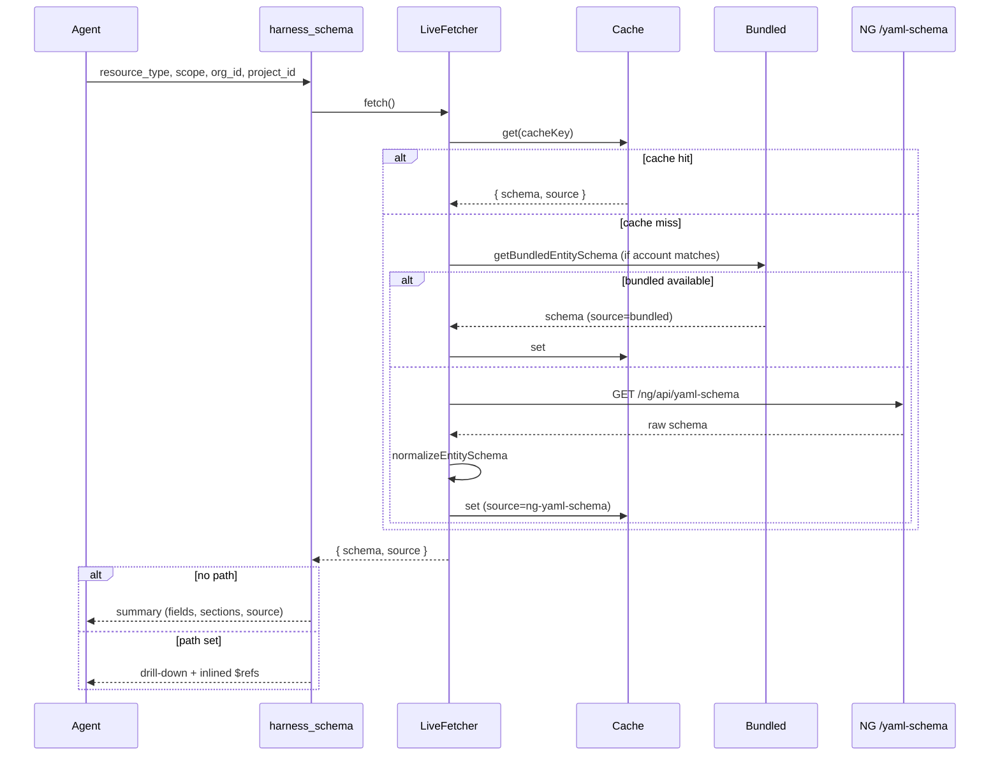

# PR: Entity YAML schemas in `harness_schema` (AIPLAT-409)

> **Branch:** `AIPLAT-409/live-entity-yaml-schema`  
> **Jira:** AIPLAT-409  
> **Target repo:** [harness/mcp-server](https://github.com/harness/mcp-server) (`main`)

---

## Summary

Extends the existing **`harness_schema`** MCP tool to return JSON Schema for Harness **platform entity YAML** types:

| Resource type | NG `entityType` |
|---------------|-----------------|
| `connector` | `Connectors` |
| `environment` | `Environment` |
| `service` | `Service` |
| `secret` | `Secrets` |
| `infrastructure` | `Infrastructure` |

Schemas come from Harness NG **`GET /ng/api/yaml-schema`**, with **vendored snapshots** under `src/data/schemas/entities/` for fast startup, offline use, and CI.

**Runtime policy:** bundled-first when snapshot account matches the configured PAT account → live API fallback.

Pipeline and template schemas are **unchanged** (still bundled from `harness-schema` via `pnpm sync-schemas`).

---

## Motivation

Agents need accurate, scope-aware JSON Schema when creating or updating NG entities. Today `harness_schema` only covers pipeline/template definitions from the static `harness-schema` repo.

Platform entities require NG’s yaml-schema API and scope-specific shapes (**account** / **org** / **project**). This change:

- Reuses the existing `harness_schema` tool (no new MCP tool).
- Aligns normalization with ml-infra `schema_base.py`.
- Avoids per-request HTTP when vendored snapshots are available.

---

## Architecture

### Two schema systems

| Kind | Resource types | Storage | How agents fetch |
|------|----------------|---------|------------------|
| **Pipeline / template** | `pipeline`, `pipeline_v1`, `template`, … | `src/data/schemas/v0`, `v1`, `local` | `harness_schema` or `schema:///` MCP resource |
| **Platform entities** (new) | `connector`, `environment`, `service`, `secret`, `infrastructure` | `src/data/schemas/entities/*.ts` + optional live API | **`harness_schema` only** (not `schema:///` resources) |

### Runtime resolution (three layers)

On each `harness_schema` call for a live entity, resolution proceeds in order:

```
┌─────────────────────────────────────────────────────────────────┐
│ 1. Runtime cache (in-memory Map, per MCP process)               │
│    Key:   {resourceType}:{scope}:{accountId}                    │
│    Value: { schema, source: "bundled" | "ng-yaml-schema" }      │
└────────────────────────────┬────────────────────────────────────┘
                             │ miss
                             ▼
┌─────────────────────────────────────────────────────────────────┐
│ 2. Bundled snapshots (disk, loaded once at module init)         │
│    Key:   {resourceType}.{scope}  e.g. connector.account       │
│    Gate:  bundledSnapshotsMatchAccount(runtime accountId)       │
└────────────────────────────┬────────────────────────────────────┘
                             │ miss or account mismatch
                             ▼
┌─────────────────────────────────────────────────────────────────┐
│ 3. Live NG API                                                  │
│    GET /ng/api/yaml-schema?entityType=...&scope=...             │
│    → extractLiveSchema → normalizeEntitySchema → cache → return │
└─────────────────────────────────────────────────────────────────┘
```

**Startup (no HTTP):** `preloadBundledEntitySchemas()` copies all **15** bundled entries (5 entities × 3 scopes) into layer 1 when `meta.accountId` in snapshots matches `client.account`.

### Request flow



### Cache vs bundled (terminology)

| Term | Meaning |
|------|---------|
| **Bundled snapshot** | Schema **origin** — vendored JSON from `pnpm sync-entity-schemas` |
| **Runtime cache** | **Delivery** — in-memory copy for the current MCP process |
| **`cache_hit: true` in logs** | This request used layer 1 only (content may still be bundled-origin) |
| **`cache_hit: false` in logs** | First use in process: loaded from layer 2 into cache |

After startup warm, typical tool calls hit **only the runtime cache**; they do not re-read disk or call the API.

### Normalization

Post-processing in `src/tools/entity-schema/normalize.ts` (aligned with ml-infra):

1. **`removeIdentifierConstFromSchema`** — strip `const` on `orgIdentifier` / `projectIdentifier`.
2. **`trimScopeRequired`** — remove org/project from `required` when not in scope.
3. **`fixConnectorIdentifierPattern`** — connector-only identifier regex on `ConnectorInfoDTO`.

Applied after live API fetch and during `pnpm sync-entity-schemas`.

### Snapshot account safety

Each vendored file exports `meta` including `accountId` from the reference account used at sync time.

- **`bundledSnapshotsMatchAccount(accountId)`** — if runtime PAT account ≠ snapshot account, **skip bundled** and use **live API**.
- Prevents serving another account’s org/project-pinned snapshots.

### Tool API

**New parameters:**

| Parameter | Type | Description |
|-----------|------|-------------|
| `scope` | `account` \| `org` \| `project` | YAML scope (default `account`) |
| `org_id` | string | Required when `scope` is `org` or `project` |
| `project_id` | string | Required when `scope` is `project` |

**Response `source`:**

| Value | Meaning |
|-------|---------|
| `"bundled"` | Served from vendored snapshot (possibly via runtime cache) |
| `"ng-yaml-schema"` | Fetched live from NG API (cached for subsequent calls) |

**Precedence** (unchanged): `example` > `example_search` > `path` > summary.

### Logging

| Log message | Meaning |
|-------------|---------|
| `Loaded bundled entity schemas from disk` | Startup: N files under `entities/` |
| `Warmed entity schema cache from bundled snapshots` | Startup: copied into runtime cache |
| `Serving entity YAML schema from bundled snapshot` + `cache_hit: true` | Request served from cache; origin is bundled |
| `Serving ...` + `cache_hit: false` | First request: bundled loaded into cache |
| `Fetching live entity YAML schema` | Layer 3 live API used |

---

## File layout

### New: `src/tools/entity-schema/`

| File | Role |
|------|------|
| `types.ts` | Scopes, fetch params, `EntitySchemaSource`, cache entry types |
| `cache-keys.ts` | Runtime cache key vs bundled file key |
| `normalize.ts` | Post-process NG schemas |
| `bundled.ts` | Load vendored files, preload/warm cache, account match |
| `live.ts` | Entity registry, API fetch, navigation, `createLiveSchemaFetcher` |

### New: `src/data/schemas/entities/`

Fifteen generated modules + `index.ts`:

```
connector.{account,org,project}.ts
environment.{account,org,project}.ts
service.{account,org,project}.ts
secret.{account,org,project}.ts
infrastructure.{account,org,project}.ts
```

Regenerate with:

```bash
pnpm sync-entity-schemas
```

**Required env:**

- `HARNESS_API_KEY`
- `HARNESS_ACCOUNT_ID` (or derivable from PAT)

**Optional (for org/project snapshots):**

- `HARNESS_ORG`
- `HARNESS_PROJECT`
- `HARNESS_BASE_URL` (default `https://app.harness.io`)

### New: sync tooling

| File | Role |
|------|------|
| `scripts/entity-schema-sync-lib.mjs` | Shared fetch / extract / normalize (aligned with runtime) |
| `scripts/sync-entity-schemas.js` | CLI to vendor schemas into `entities/` |
| `.github/workflows/sync-entity-schemas.yml` | Weekly + `workflow_dispatch` PR to refresh snapshots |

**GitHub Action secrets:**

- `HARNESS_ENTITY_SCHEMA_SYNC_API_KEY`
- `HARNESS_ENTITY_SCHEMA_SYNC_ACCOUNT_ID`
- `HARNESS_ENTITY_SCHEMA_SYNC_ORG` (org/project scopes)
- `HARNESS_ENTITY_SCHEMA_SYNC_PROJECT` (project scope)
- `HARNESS_ENTITY_SCHEMA_SYNC_BASE_URL` (optional)

### Modified

| File | Change |
|------|--------|
| `src/tools/harness-schema.ts` | Live entity branch, scope params, accurate `source` |
| `src/tools/index.ts` | Pass `registry` + `client` to `registerSchemaTool` |
| `src/resources/harness-schema.ts` | Document: entities use tool, not `schema:///` |
| `package.json` | Add `sync-entity-schemas` script |
| `.env.example` | Document sync env vars |
| `.gitignore` | Ignore `.pnpm-store/` |

### Tests

| File | Coverage |
|------|----------|
| `tests/tools/entity-schema-normalize.test.ts` | Const removal, required trimming, connector pattern |
| `tests/tools/entity-schema-bundled.test.ts` | Bundled path skips API; account mismatch |
| `tests/tools/harness-schema-tool.test.ts` | Tool wiring, caching, static pipeline unchanged |

---

## NG API reference

**Endpoint:** `GET /ng/api/yaml-schema` (via `HarnessClient`)

**Query parameters:**

| Param | Notes |
|-------|-------|
| `entityType` | See table in Summary |
| `scope` | `account`, `org`, or `project` |
| `orgIdentifier` | Required for `org` and `project` |
| `projectIdentifier` | Required for `project` |
| `accountIdentifier` | Injected by client |

---

## Commits on this branch

| Commit | Description |
|--------|-------------|
| `fix: [AIPLAT-409]: declare supportedScopes on template_v1` | Related template scope metadata |
| `feat: [AIPLAT-409]: entity YAML schemas in harness_schema with bundled snapshots` | Main feature |

---

## Test plan

- [x] `pnpm build`
- [x] Unit tests: `entity-schema-normalize`, `entity-schema-bundled`, `harness-schema-tool`
- [x] Manual MCP: all 5 entities × 3 scopes
  - `account` — no org/project params
  - `org` — `org_id`
  - `project` — `org_id` + `project_id`
- [x] Logs: bundled serve with `cache_hit: true`; no `/ng/api/yaml-schema` after warm
- [x] Response `source: "bundled"` when snapshot account matches PAT account
- [ ] CI green on Harness PR pipeline
- [ ] Optional: remove `entities/*.ts` locally → verify live fallback and `source: "ng-yaml-schema"`

### Example MCP calls

```json
{ "resource_type": "connector", "scope": "account" }
```

```json
{
  "resource_type": "environment",
  "scope": "project",
  "org_id": "default",
  "project_id": "aidevops"
}
```

---

## Operational notes

- **Large diff:** ~78k lines are vendored JSON Schema in `entities/*.ts` (expected; do not hand-edit).
- **Bundled-first** at runtime; refresh via `pnpm sync-entity-schemas` or the GitHub Action.
- **After merge:** bump `harness-mcp-v2` package version; consume from `mcpServerInternal` per release process.

---

## Related

- ml-infra: `schema_base.py` normalization patterns
- Existing pipeline sync: `pnpm sync-schemas` → `src/data/schemas/v0|v1/`
